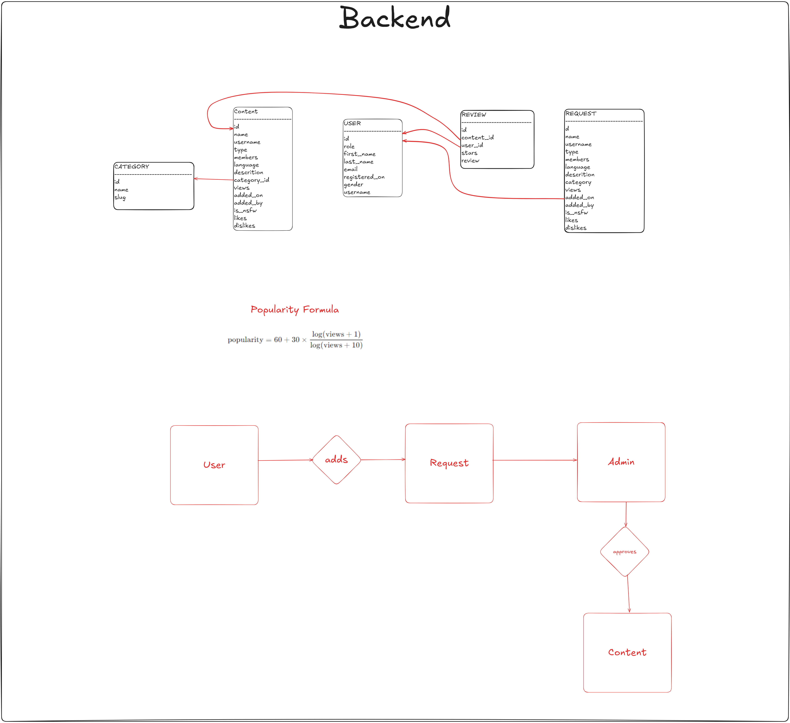

# Telebuzzed Backend

This repository contains the backend code for [Telebuzzed](https://telebuzzed.com), a directory website for discovering Telegram bots, channels, and groups. The backend is built using Node.js with Express, Mongoose for database management, and JWT for authentication.

## Features

- **Express**: For handling API routes and middleware.
- **Mongoose**: Object Data Modeling (ODM) for MongoDB.
- **JWT Authentication**: For secure user login and session management.
- **Multer**: For handling file uploads.
- **Cloudinary**: For managing media storage in the cloud.
- **Cheerio**: For web scraping capabilities.
- **Bcrypt**: For secure password hashing.

## UI Flow (Under Development)



## Installation

1. Clone the repository:

   ```bash
   git clone https://github.com/TerminalWarlord/Telebuzzed-Backend.git
   cd Telebuzzed-Backend
   ```

2. Install the dependencies:

   ```bash
   npm install
   ```

3. Create a `.env` file in the root directory with the following variables:

   ```
   PORT=your_port
   MONGODB=your_mongodb_uri
   JWT_SECRET=your_jwt_secret
   CLOUDINARY_CLOUD_NAME=your_cloudinary_name
   CLOUDINARY_API_KEY=your_cloudinary_api_key
   CLOUDINARY_API_SECRET=your_cloudinary_api_secret
   ```

4. Start the server:
   ```bash
   npm start
   ```

## Usage

Once the server is up and running, you can interact with the API. For example, you can create users, manage Telegram bot listings, and more. Be sure to secure the API using JWT tokens.

## Technologies Used

- **Node.js**
- **Express**
- **MongoDB + Mongoose**
- **JWT**
- **Cloudinary** for media management
- **Multer** for file uploads
- **Cheerio** for scraping
- **Bcrypt** for password hashing

## Development

For development purposes, you can run the server with `nodemon`, which watches for file changes and restarts the server automatically.

```bash
npm run start
```

## Contributing

Contributions are welcome! Feel free to fork the repository and submit a pull request.

## License

This project is licensed under the MIT License. See the [LICENSE](LICENSE) file for details.
